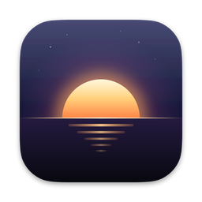
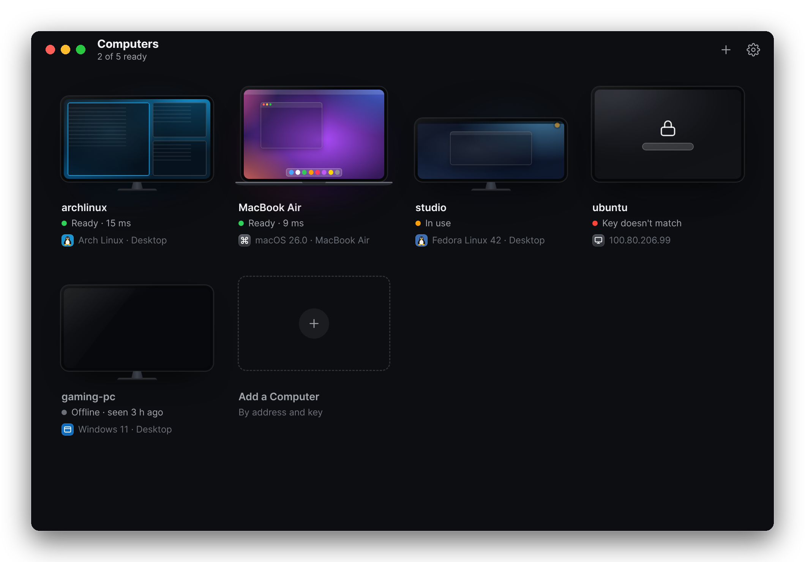
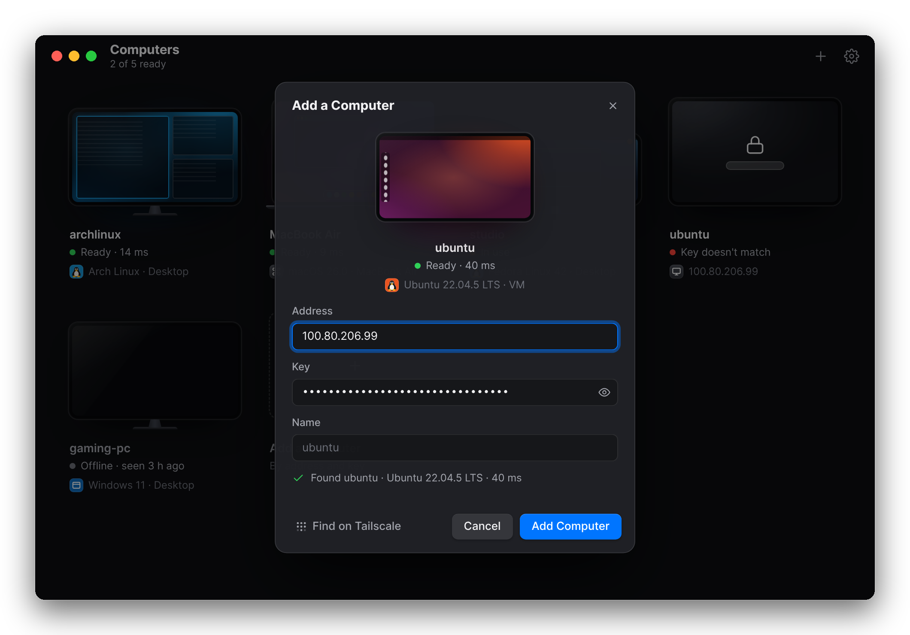

<p align="center"></p>

<h1 align="center">Sunna</h1>

<p align="center">Your other computers, on your Mac. A fast, native remote desktop for Mac and Linux, over your own network.</p>

<p align="center"><a href="https://34.131.68.196">Website</a> · <a href="#quick-start">Quick start</a> · <a href="#troubleshooting">Troubleshooting</a></p>

<p align="center"></p>

Sunna shows another computer's screen on your Mac and sends your keyboard, mouse, trackpad and clipboard back. It uses the hardware video encoders and decoders where they exist and sends small changes like typing as exact, lossless tiles ahead of the video, so text appears as fast as your network allows. There are no accounts and no cloud service: computers talk to each other directly, ideally over [Tailscale](https://tailscale.com).

**Status: early, and in daily use by its developer.** It works well Mac → Mac and Mac → Linux (X11). Not yet: Windows, viewing from Linux (dev tool only), and sharing a Wayland desktop (see [Linux](#share-a-linux-computer)). Read [Security](#security-and-privacy) before using it outside your own network.

## Quick start

1. **Share a computer** (the *host*). On Linux, `scripts/install-host-linux.sh` builds the host, installs it as a service and sets it up ([details](#share-a-linux-computer)). On a Mac, see [Share a Mac](#share-a-mac). Either way you get an address, a key and a link:

   ```
       Address   100.101.102.103
       Key       7f3a…

     In the Sunna app, choose Add a Computer and paste:
       sunna://100.101.102.103?key=7f3a…
   ```

2. **Install the Sunna app on your Mac** ([details](#install-the-mac-app)):

   ```sh
   git clone https://github.com/SunnyXdm/sunna.git && cd sunna
   scripts/install-mac-app.sh
   ```

3. **Open Sunna, choose Add a Computer and paste the link.** The computer shows up with its screen lit when it can be reached; click it to connect.

## Install the Mac app

`scripts/install-mac-app.sh` builds **Sunna.app**, installs it in `/Applications` (or `~/Applications` if you can't write there) and opens it. Run it again to update. You need:

- macOS 13 or later (so far tested on Apple silicon)
- the Xcode command line tools: `xcode-select --install`
- Rust: [rustup.rs](https://rustup.rs)

The first time you connect to a computer, macOS asks to give Sunna **Accessibility** access (System Settings → Privacy & Security → Accessibility). It's only needed to send ⌘Tab, ⌘Space and other system shortcuts to the other computer; without it those stay on your Mac and everything else works. Reconnect after allowing it.

**To give it to someone else,** `scripts/install-mac-app.sh --dmg` also makes `dist/Sunna.dmg`. The app is built for your Mac's chip (Apple silicon or Intel) and signed ad hoc, since there's no Apple developer account behind it, so macOS blocks it on another Mac the first time: open it, then click **Open Anyway** in System Settings → Privacy & Security. (On macOS 14 and earlier, right-click the app and choose **Open** instead.)

**To remove it,** quit Sunna and move it from Applications to the Trash. The computers you added and their keys are in `~/.sunna`; delete that folder to remove them too.

## Share a Linux computer

The Linux host is `sunnad` plus `sunna-host`, a small command that runs it as a service: it starts by itself (at login, or at boot for a virtual desktop), restarts if it crashes, and logs to the system journal.

There are no prebuilt downloads yet, so you build it on the computer itself, which takes a few minutes. You need Rust ([rustup.rs](https://rustup.rs)), a C/C++ compiler and, on x86-64, nasm, without which the video encoder runs 3–4× slower. On Debian and Ubuntu: `sudo apt install build-essential nasm`. The scripts tell you if something is missing.

**Any distribution** (Ubuntu, Debian, Arch, Fedora…), as the user whose desktop to share:

```sh
git clone https://github.com/SunnyXdm/sunna.git && cd sunna
scripts/install-host-linux.sh
```

This installs `sunnad` and `sunna-host` into `~/.local/bin` for your user, without root, then runs `sunna-host setup`, which prints the link to paste into the app. Run it again to update; your settings and key are kept.

**As a package, on Debian and Ubuntu,** for example to install it on several machines:

```sh
scripts/package-linux-deb.sh            # makes dist/sunna-host_<version>-<build>_<arch>.deb
sudo apt install ./dist/sunna-host_*.deb
sunna-host setup                        # as the user whose desktop to share
```

The package runs on the release it was built on and newer ones: build it on Ubuntu 22.04 to cover Ubuntu 22.04+ and Debian 12+.

### Which desktop gets shared

| Mode | What you see | Use it for |
|---|---|---|
| `desktop` | the X11 desktop you're logged into | a PC or laptop you also use directly |
| `virtual` | a separate desktop that runs without a screen (Xvfb with Plasma or XFCE) | servers and VMs, and machines whose own desktop is Wayland |

`sunna-host setup` picks for you: `desktop` if you run it in a terminal on an X11 desktop, otherwise `virtual` (over SSH, for example). Choose explicitly with `--desktop` or `--virtual`.

**Wayland:** Sunna can't capture a Wayland desktop yet; that includes Ubuntu's default session, and GNOME, Plasma or Hyprland on Wayland. Either log in with an X11 session (on Ubuntu, pick "Ubuntu on Xorg" on the login screen) or use a virtual desktop. Wayland support is planned.

**A virtual desktop** needs Xvfb and a desktop environment; `sunna-host setup` tells you what's missing (on Debian and Ubuntu: `sudo apt install xvfb x11-utils dbus-x11 xfce4`). It uses Plasma if that's installed, otherwise XFCE. It keeps running after you disconnect, with the apps you opened in it, like a real computer would, and restarting the host doesn't close it. `sunna-host desktop-stop` stops it, its apps and the host; `sunna-host start` brings both back.

### Commands

| Command | |
|---|---|
| `sunna-host setup` | choose how to share, then start (options below) |
| `sunna-host link` | show the address, key and link again |
| `sunna-host status` | running? listening where? is someone connected? |
| `sunna-host start`, `stop`, `restart` | start or stop sharing |
| `sunna-host logs` | follow the log |
| `sunna-host new-key` | make a new key; computers that saved the old one need the new one (click them in the app and paste it) |
| `sunna-host desktop-restart` | restart the virtual desktop (this closes its apps) |
| `sunna-host desktop-stop` | stop the host, the virtual desktop and its apps |
| `sunna-host uninstall [--purge]` | stop sharing and remove the service (and, for an install from source, the programs); `--purge` also deletes the settings and key. For the package, follow with `sudo apt remove sunna-host`. |
| `sunna-host help` | these commands and options, in the terminal |

| `setup` option | |
|---|---|
| `--desktop` | share the X11 desktop you're logged into |
| `--virtual` | share a separate desktop that runs without a screen |
| `--listen WHERE` | `tailscale` (only your tailnet; the default when Tailscale is running), `lan` (your local network), or an address like `192.168.1.20` or `192.168.1.20:48800` |
| `--name NAME` | how the computer is called in the app (default: its hostname) |
| `--key KEY` | use this key instead of making one |
| `--size WxH` | the virtual desktop's size (default 1710x1112) |

Settings live in `~/.config/sunna/host.env`, readable only by you: the key, name, where to listen, port (48800), mode, and the virtual desktop's display, size and desktop (`plasma` or `xfce`). After editing it, run `sunna-host restart`. For the mode and the virtual desktop's settings, run `sunna-host setup` instead; a new size or desktop applies after `sunna-host desktop-restart`.

### Running sunnad yourself

`sunna-host` is a convenience around the daemon. To run `sunnad` directly, for example from your own service or a container, give it the X11 display, an address and a key:

```sh
DISPLAY=:0 sunnad --source screen --listen 100.101.102.103:48800 --name office --token "$KEY"
```

`--listen` takes an IP address and port (no `tailscale` or `lan` shortcuts here). Without `--token`, it makes a key and prints it when listening beyond loopback. `sunnad --help` lists the rest: stream size, frame rate, codec, bitrate, and `--no-clipboard`.

**Video:** with an NVIDIA GPU (GTX 10-series or newer, driver 530+) the host encodes HEVC on the GPU, in about 4 ms a frame. Otherwise it encodes H.264 on the CPU with OpenH264, about 8–9 ms for a 1080p frame on a 6-core machine when built with nasm. For slow computers, the session menu's **30 fps** option halves the work.

## Share a Mac

For now a Mac host runs in a Terminal window. It needs the same tools as the app (the Xcode command line tools and Rust), plus [Tailscale](https://tailscale.com): it listens only on the Mac's tailnet address. Make a key (this leaves an existing one alone), then start it:

```sh
grep -qs '^SUNNA_TOKEN=' ~/.sunna/sunna.env || (mkdir -p ~/.sunna && umask 077 && echo "SUNNA_TOKEN=$(openssl rand -hex 16)" >> ~/.sunna/sunna.env)
git clone https://github.com/SunnyXdm/sunna.git && cd sunna
scripts/run.sh host
```

It prints the address, key and link, and shares until you press Ctrl-C or close the window, while the Mac is awake. The first time, macOS asks for **Screen Recording** and **Accessibility** for your terminal app: allow both, quit the terminal, and run it again. The key is the same one the Sunna app on that Mac shows in Settings as this computer's key.

An installable Mac host, shared from the app, is planned.

## Using Sunna



- **Add a computer** with **+** (⌘N): type its address (an IP, a name, or `name.tailnet.ts.net`) and key, or paste its `sunna://` link. The preview lights up as soon as the computer answers. **Find on Tailscale** lists the computers on your tailnet that are sharing.
- **Connect** by clicking a computer whose screen is lit. Its screen grows to fill the window and the session opens in a window of its own, full screen unless you choose otherwise in Settings.
- **Right-click** a computer (or use its ••• button) to edit it, copy its address or remove it.
- **Settings** (⌘,): whether sessions open full screen or in a window, the stats bar and the ••• menu button, and this Mac's own key and link.
- The app never scans your network by itself: it checks only the computers you've added, every few seconds while its window is open.

| In the app | |
|---|---|
| ⌘N | add a computer |
| ⌘1 … ⌘9 | connect to the first nine computers |
| ⌘E, ⌫ | edit or remove the selected computer (Tab, then the arrow keys, to select one) |
| ⌘R | check all computers again |
| ⌘, | settings |
| Esc | stop connecting |

### During a session

Open the session menu with the **•••** button at the top left or **⌃⌥M**:

| | |
|---|---|
| Keyboard | send ⌘ shortcuts to the remote, and **Send Keys**, shortcuts for the remote's system: on a Mac, Switch Apps (⌘Tab), Spotlight, Mission Control, Force Quit, Lock Screen and Escape; on Linux, Switch Windows (Alt+Tab), App Launcher (Super), Terminal, Lock Screen, Log Out and Escape |
| Clipboard | share the clipboard (text and images, both ways) or not; **Type Clipboard Text** types it out key by key, for login screens and password prompts that won't take a paste |
| Video | codec (HEVC, H.264), resolution, frame rate, bitrate limit, and the fast lane |

The menu also switches between full screen and a window, and shows the stats bar, hides the ••• button, or disconnects.

| Shortcut | |
|---|---|
| ⌃⌥M | session menu |
| ⌃⌥G | give ⌘Tab and other shortcuts back to this Mac (or send them to the remote again) |
| ⌃⌥F | full screen or window |
| ⌃⌥S | stats bar (latency, frame rate, bitrate, codec) |
| ⌃⌥Q | disconnect |

A computer takes one viewer at a time; while someone is connected, the app shows it as **In use**.

**The fast lane** sends small screen changes (a typed letter, a blinking cursor) as lossless tiles on their own stream, ahead of the video frame that will also contain them. On a host that encodes on the CPU, typed text arrives in about 2 ms plus the network; the video took 35–37 ms in the same test (a 6-core VM, viewer on the same machine). It's on by default for Linux hosts encoding on the CPU; turn it on or off in the session menu under Video.

## Troubleshooting

| What you see | What to do |
|---|---|
| **Not responding** or **Offline** | The host isn't running or can't be reached. On a Linux host, run `sunna-host status`. Check that Tailscale is connected on both computers, and that no firewall on the host blocks UDP port 48800. |
| **Key doesn't match** | The computer's key changed. `sunna-host link` on it shows the new one; click the computer in the app and paste it. |
| **In use** | Someone else is connected. A computer takes one viewer at a time. |
| **Needs an update** | The app and the host are from different versions. Update both: `git pull`, then run the install scripts again. |
| **Address not found** | The name doesn't resolve. Use the IP address or the full Tailscale name (`name.tailnet.ts.net`). |
| ⌘Tab and ⌘Space stay on your Mac | Give Sunna Accessibility access (System Settings → Privacy & Security → Accessibility), then reconnect. ⌃⌥G also switches them between your Mac and the remote. |
| On Wi-Fi, the video hitches about once a second | That's the Mac's AirDrop radio (AWDL) scanning. `sudo ifconfig awdl0 down` turns it off, and AirDrop with it, until macOS turns it back on or you run `sudo ifconfig awdl0 up`. |
| Choppy video from a Linux host without an NVIDIA GPU | Choose **30 fps** or a lower resolution in the session menu. If the host was built before nasm was installed, run the install script again: it rebuilds the encoder. |
| A Linux desktop won't share | It's probably a Wayland session: log in with an X11 session, or run `sunna-host setup --virtual`. |
| Anything else | The host's log: `sunna-host logs` on Linux, or the Terminal window on a Mac. The app's log: quit Sunna and run `/Applications/Sunna.app/Contents/MacOS/Sunna` in Terminal. |

## Security and privacy

- **Keys.** A host only accepts viewers that present its key. Keep keys secret; anyone with a computer's address and key can control it. The app keeps the computers you add, with their keys, in `~/.sunna/machines.json`, and this Mac's own key in `~/.sunna/sunna.env`, both readable only by you.
- **Encryption.** Connections use QUIC, encrypted with TLS 1.3. The app does **not yet verify the host's identity** (hosts use self-signed certificates), so on a network you don't control, someone in the middle could impersonate a host. Use Sunna over **Tailscale** (which authenticates both ends with WireGuard) or a network you trust, and never expose a host to the internet. `sunna-host setup` listens only on your tailnet when Tailscale is running, and warns you when it falls back to your local network. Pinning each host's certificate is planned.
- **No cloud, no accounts.** Computers connect to each other directly. Nothing is sent anywhere else.
- **Logs stay local.** The host logs to the system journal (Linux) or its Terminal window (Mac). The app logs only to its standard error, which macOS discards unless you start it from Terminal. Keystrokes and clipboard contents are never logged. (Development builds can also send logs to a collector you run, only when `SUNNA_LOG_URL` is set.)
- **Idle cost.** A host with nobody connected uses no CPU and holds one listening UDP port (48800 by default).

## Requirements

| | |
|---|---|
| The app | macOS 13 or later |
| A Mac host | macOS 13 or later; Tailscale; Screen Recording and Accessibility permission for the terminal it runs in |
| A Linux host | x86-64 (ARM64 untested); an X11 desktop, or Xvfb with Plasma or XFCE for a virtual one; to build it, Rust, a C/C++ compiler and nasm |
| Network | the host's UDP port 48800 reachable from the viewer; [Tailscale](https://tailscale.com) recommended |

## Building from source

Everything is one Rust workspace:

```sh
cargo build --release              # sunnad (the host) and sunna-cli (a developer client)
cargo build --release -p sunna     # the app; on Linux this needs WebKitGTK, like any Tauri app
cargo test                         # add --workspace to include the app
```

| Path | |
|---|---|
| `apps/sunna` | the Mac app (Tauri): the launcher UI in `ui/`, and `sunna viewer`, the native session window |
| `apps/sunnad` | the host daemon |
| `apps/sunna-cli` | developer client: `view`, `connect` (headless), `bench` (loopback benchmark) |
| `crates/transport` | QUIC (quinn): media datagrams, reliable control stream, TLS |
| `crates/proto` | wire messages, packetizing and reassembly, fast-lane tiles |
| `crates/capture` | screen capture: macOS (CGDisplayStream), X11 (MIT-SHM); fast-lane tile detection |
| `crates/codec` | encoders and decoders: VideoToolbox, NVENC, OpenH264 |
| `crates/host`, `crates/client` | the host and client pipelines |
| `crates/viewer` | the session window: presentation, keyboard capture, session menu |
| `crates/input`, `crates/clipboard` | input injection and clipboard sync |
| `crates/telemetry` | logging, and shipping logs to a development collector |
| `tools/` | the log collector (`logd`), and `wayland-poc.py`, the proof that Wayland capture and input work through the desktop portals |
| `scripts/` | installers and packaging (`install-mac-app.sh`, `install-host-linux.sh`, `package-linux-deb.sh`, `sunna-host`), the developer loop (`run.sh`), and `wayland-desktop.sh`, a Wayland desktop without a screen for Wayland work |
| `docs/` | the website |
| `research/` | the research and architecture notes behind the design; start at [`00-overview.md`](research/00-overview.md) |

The launcher UI can be worked on in a browser with a stand-in for the Rust side: `python3 -m http.server 8766 -d apps/sunna` and open `localhost:8766/ui/` (see `apps/sunna/dev/`).

## License

No license has been chosen yet; until one is, all rights are reserved.
